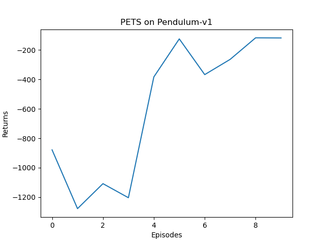
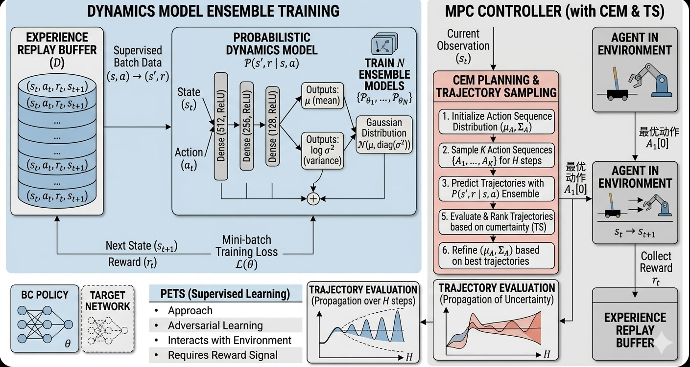

# PETS - Probabilistic Ensemble Trajectory Sampling

## Project Overview
PETS is a model-based reinforcement learning algorithm that uses probabilistic ensemble models to predict environment dynamics and optimize policies through trajectory sampling. This project implements the core functionality of the PETS algorithm, suitable for continuous control tasks.

### Result Demonstration


### Network Architecture


## Environment Requirements
- Python 3.9+
- numpy>=1.21.0
- scipy>=1.7.0
- gym>=0.21.0
- torch>=1.10.0
- matplotlib>=3.4.0

## Installation
```bash
git clone https://github.com/xiaoshengdianzi/PETS_Project.git
cd PETS_Project  # Enter the cloned directory
pip install -r requirements.txt
```

## Usage
```bash
# Run PETS algorithm
python pets_main.py
```

## Project Structure
```
├── pets_main.py       # Main running file
├── cem.py            # CEM optimizer implementation
├── models.py         # Probabilistic ensemble model implementation
├── replay_buffer.py  # Experience replay buffer
├── fake_env.py       # Simulation environment
├── requirements.txt  # Project dependencies
├── README.md         # Project description
└── LICENSE           # License
```

## Core Features
- **Probabilistic Ensemble Model**: Uses multiple neural network models to provide uncertainty estimation
- **CEM Optimizer**: Optimizes trajectories using cross-entropy method
- **Experience Replay**: Stores and samples historical experience
- **Simulation Environment**: Used to test algorithm performance

## Contribution Guidelines
Contributions are welcome! Please submit Issues and Pull Requests to improve the project.

## License
This project uses the MIT License.

## Deployment and Release

### Deployment Process
1. **Environment Preparation**: Configure the deployment environment and install necessary dependencies
2. **Code Deployment**: Deploy the code to the target server
3. **Configuration Settings**: Modify configuration files to adapt to the production environment
4. **Service Startup**: Start the project service

### Release Process
1. **Version Number Update**: Update the project version number
2. **Testing**: Execute tests to ensure functionality
3. **Packaging**: Package the project (e.g., Python package, Docker image)
4. **Release**: Publish to the corresponding platform (e.g., PyPI, Docker Hub)

## Maintenance

### Code Maintenance
- Regularly update dependencies
- Fix bugs and security vulnerabilities
- Optimize code performance

### Documentation Maintenance
- Update README.md to reflect project changes
- Add documentation for new features
- Maintain API documentation

### Community Maintenance
- Respond to issues and PRs
- Manage project milestones
- Plan future features

## Blog
- [4、模型预测（MPC）PETS复现demo](https://blog.csdn.net/m0_66676819/article/details/159986752?sharetype=blogdetail&sharerId=159986752&sharerefer=PC&sharesource=m0_66676819&spm=1011.2480.3001.8118)